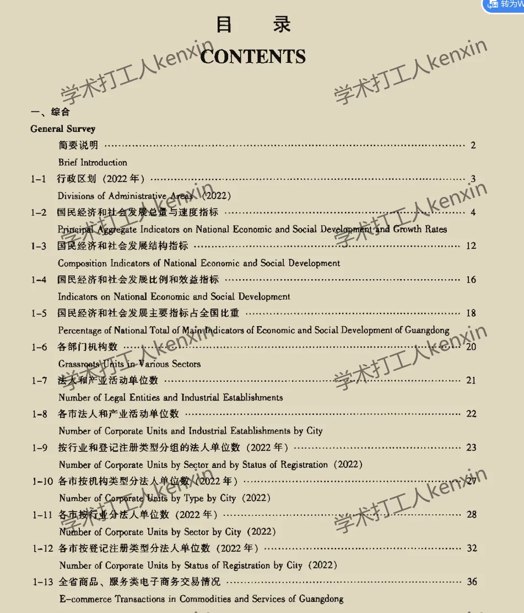
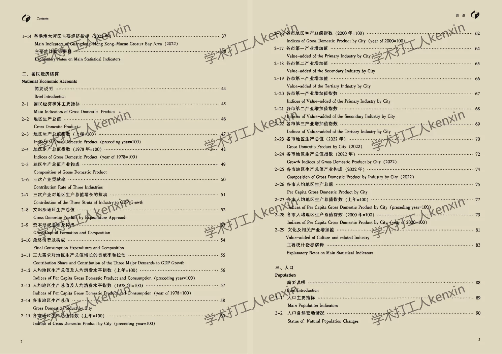
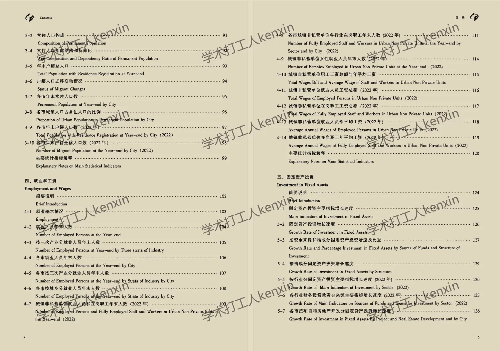
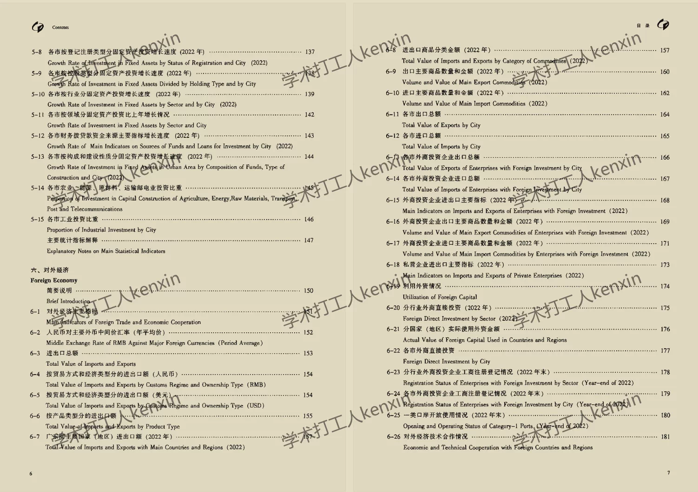
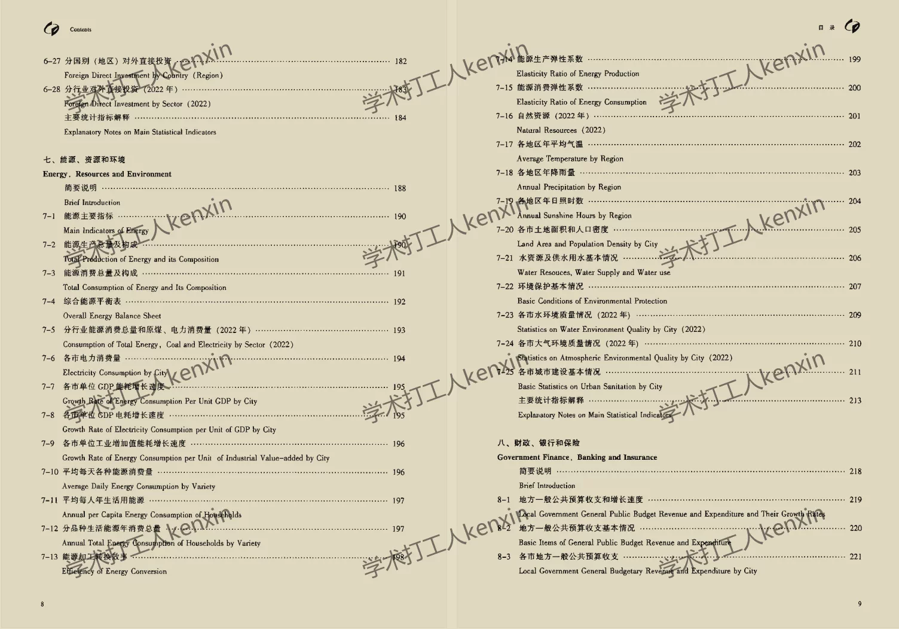
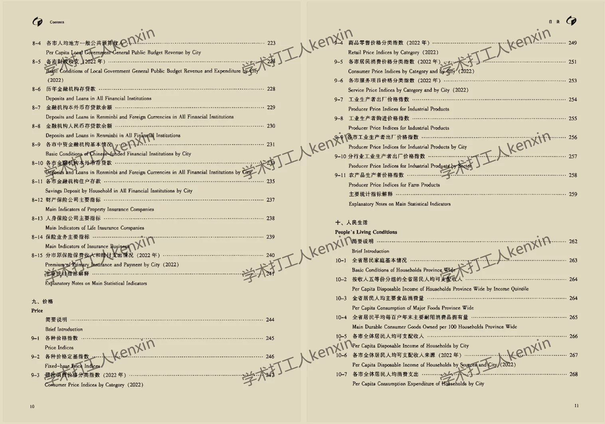
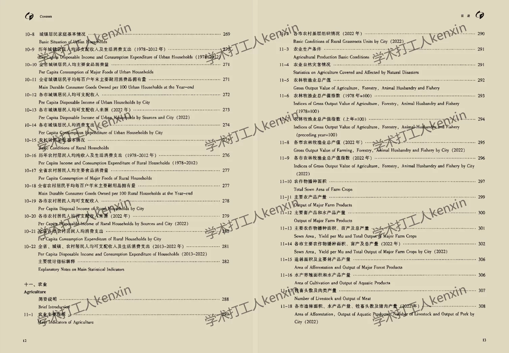
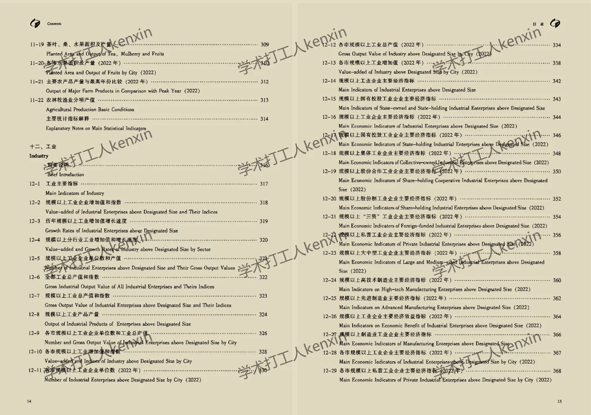

## Body

"Guangdong Province Statistical Yearbook" (1984-2025)

Data Year: The title year is the year the data was compiled, so the data year needs to be one less than the title year.
Please review the image below before purchasing! The complete description has been shown, please confirm if it's what you need before purchasing! No returns or exchanges after shipment.

01. Data Introduction
"Guangdong Province Statistical Yearbook"

02. Indicator Details
(1) The directory is displayed in the image, please take a look on your own and make a purchase accordingly. If you need help finding specific indicators, they are all here. After shipment, there will be no return or exchange without any reason.
(2) The display directory is for the year 2023, and the length of the content is quite long. The different years' statistical standards may change. Academic common sense, the data recorded in statistical materials is the data from the previous year as well, which is also a common sense. Please be aware of this.
(3) The EXCEL format data is organized from original materials, including the content of the original material data but not the text content.
(4) If the data is placed in a zip file, you need to save the zip file first, then download, and then unzip.
(5) If there is Excel protection, you can select all and copy to a new sheet to use.

03. Data Format
1984-2023: PDF and Excel
2024: CD-ROM edition and Excel
2025: CD-ROM edition

## Images

item_1070689585257

Here is a pay link on Stripe ( https://buy.stripe.com/3cs8yP7sY87d0vu9AB ). Please contact me lonlonago@foxmail.com after funding $89, and I will send you a complete data files , thank you!

